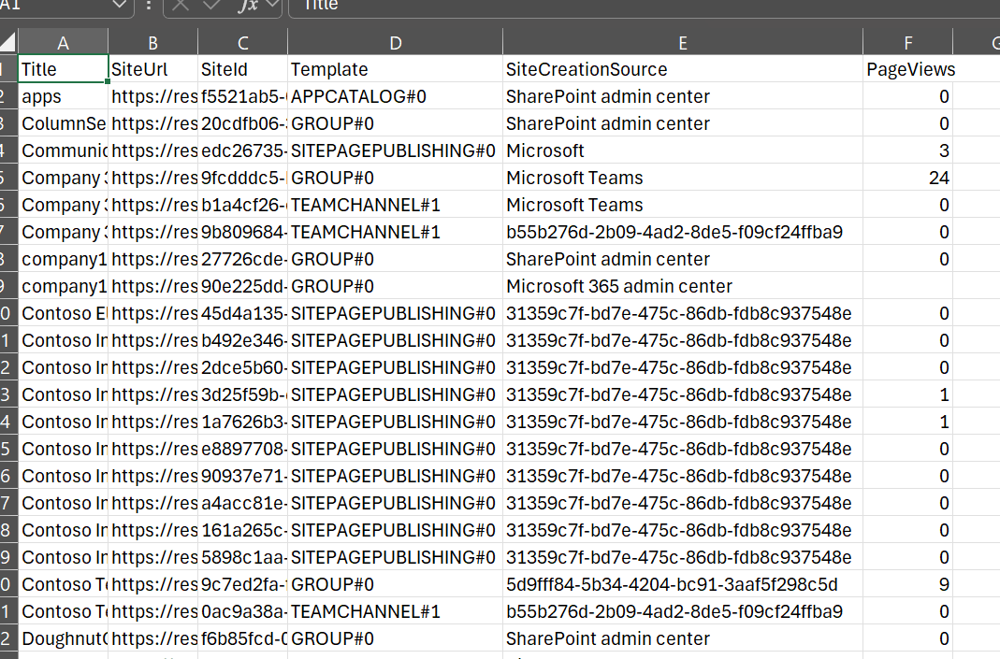

# Identifying SharePoint Site Creation Sources

## Summary

Understanding how a SharePoint site was created is crucial for governance, compliance, and troubleshooting. In Microsoft 365, SharePoint sites can be created through various methods, such as Microsoft Teams, Viva Engage, the SharePoint Admin Center, and more. However, identifying the exact creation source can sometimes be challenging.

The script is particularly useful in identifying the site creation sources. However if the site has been created using custom solutions or PowerShell scripts, a GUID will be returned. 



### Prerequisites

- The user account that runs the script must have access as SharePoint Administrator.
- PnP PowerShell module installed
- Entra ID registration with correct permissions

# [PnP PowerShell](#tab/pnpps)

```powershell
param (
    [Parameter(Mandatory = $true)]
    [string] $domain
)

$siteCreationSources = @(
    @{ DisplayName = "Unknown"; Id = "00000000-0000-0000-0000-000000000000"; Name = "Unknown" },
    @{ DisplayName = "SharePoint start page"; Id = "a958918c-a597-4058-8ac8-8a98b6e58b45"; Name = "SPHome" },
    @{ DisplayName = "OneDrive"; Id = "55cff85e-f373-4768-a7c8-56e7e318e760"; Name = "ODB" },
    @{ DisplayName = "SharePoint admin center"; Id = "39966a89-5583-4e7f-a348-af1bf160ae49"; Name = "SPTenantAdmin" },
    @{ DisplayName = "PowerShell"; Id = "36d0e864-21ac-40c2-bb7e-7902c1d57c4a"; Name = "PowerShell" },
    @{ DisplayName = "API"; Id = "62aeb6b0-f7c5-4659-9f0a-0e08978661ff"; Name = "API" },
    @{ DisplayName = "Migration"; Id = "70fbaeeb-90ae-4a83-bec4-72273ea97b89"; Name = "Migration" },
    @{ DisplayName = "Hub site"; Id = "37c03f2d-ef6a-4baf-b79d-58ab39757312"; Name = "HubSite" },
    @{ DisplayName = "Microsoft 365 group"; Id = "2042b5d3-c5ec-41d1-b13c-0e53936c2c67"; Name = "GroupStatus" },
    @{ DisplayName = "SharePoint app"; Id = "00000003-0000-0ff1-ce00-000000000000"; Name = "SPApplication" },
    @{ DisplayName = "Outlook"; Id = "00000002-0000-0ff1-ce00-000000000000"; Name = "EXO" },
    @{ DisplayName = "Microsoft 365 group"; Id = "00000003-0000-0000-c000-000000000000"; Name = "MSGraph" },
    @{ DisplayName = "Microsoft Teams"; Id = "cc15fd57-2c6c-4117-a88c-83b1d56b4bbe"; Name = "TeamsService" },
    @{ DisplayName = "Viva Engage"; Id = "00000005-0000-0ff1-ce00-000000000000"; Name = "Yammer" },
    @{ DisplayName = "Planner"; Id = "09abbdfd-ed23-44ee-a2d9-a627aa1c90f3"; Name = "Planner" },
    @{ DisplayName = "PnP provisioning"; Id = "410e0a1c-77e2-4166-b91c-ba5cec4f658d"; Name = "PnP" },
    @{ DisplayName = "Microsoft"; Id = "03cd98f4-670d-44c4-8866-1a9a93079b6c"; Name = "SPTenantProvisioning" },
    @{ DisplayName = "My AAD Portal"; Id = "74658136-14ec-4630-ad9b-26e160ff0fc6"; Name = "AADPortal" },
    @{ DisplayName = "My Apps portal"; Id = "65d91a3d-ab74-42e6-8a2f-0add61688c74"; Name = "AADMyApps" },
    @{ DisplayName = "Graph Explorer"; Id = "de8bc8b5-d9f9-48b1-a8ad-b748da725064"; Name = "GraphExplorer" },
    @{ DisplayName = "Microsoft 365 admin center"; Id = "00000006-0000-0ff1-ce00-000000000000"; Name = "O365AdminCenter" },
    @{ DisplayName = "Project"; Id = "f53895d3-095d-408f-8e93-8f94b391404e"; Name = "Project" },
    @{ DisplayName = "Microsoft Stream"; Id = "2634dd23-5e5a-431c-81ca-11710d9079f4"; Name = "Stream" },
    @{ DisplayName = "Power BI"; Id = "00000009-0000-0000-c000-000000000000"; Name = "PowerBI" },
    @{ DisplayName = "Microsoft Teams PowerShell"; Id = "12128f48-ec9e-42f0-b203-ea49fb6af367"; Name = "TeamsPowerShell" },
    @{ DisplayName = "Microsoft Stream"; Id = "cf53fce8-def6-4aeb-8d30-b158e7b1cf83"; Name = "StreamUI" }
)

Clear-Host
$dateTime = (Get-Date).toString("dd-MM-yyyy-hh-mm")
$invocation = (Get-Variable MyInvocation).Value
$directorypath = (Split-Path $invocation.MyCommand.Path) + "\"
$exportFilePath = Join-Path -Path $directorypath -ChildPath $([string]::Concat($domain,"-createdSource_",$dateTime,".csv"));

$adminSiteURL = "https://$domain-Admin.SharePoint.com"
Connect-PnPOnline -Url $adminSiteURL

$list = "DO_NOT_DELETE_SPLIST_TENANTADMIN_AGGREGATED_SITECOLLECTIONS"
$query = @"
     <View>
         <Query>
             <Where>
                <Neq><FieldRef Name='State'/><Value Type='Integer'>0</Value></Neq>
             </Where>
            <OrderBy><FieldRef Name='Title' Ascending='true' /></OrderBy>
         </Query>
         <ViewFields>
            <FieldRef Name='Title'/>
            <FieldRef Name='SiteUrl'/>
            <FieldRef Name='SiteId'/>
            <FieldRef Name='SiteCreationSource'/>
            <FieldRef Name='TimeDeleted'/>
            <FieldRef Name='TemplateName'/>
            <FieldRef Name='PageViews'/>
         </ViewFields>
     </View>
"@


$items = Get-PnPListItem -List $List -PageSize 2000 -Query $query | Where-Object { -not $_.FieldValues["TimeDeleted"] }

# Create a report
$report = @()
foreach ($item in $items) {
        $report += [PSCustomObject]@{
            Title = $item.FieldValues["Title"]
            SiteUrl     = $item.FieldValues["SiteUrl"]
            SiteId        = $item.FieldValues["SiteId"]
            Template = $item.FieldValues["TemplateName"]
            SiteCreationSource = ($siteCreationSources | Where-Object { $_.Id -eq $item.FieldValues["SiteCreationSource"] }).DisplayName ?? $item.FieldValues["SiteCreationSource"] 
            PageViews = $item.FieldValues["PageViews"]
        }
}

# Export the report to a CSV file
$report | Export-Csv -Path $exportFilePath -NoTypeInformation
```

[!INCLUDE [More about PnP PowerShell](../../docfx/includes/MORE-PNPPS.md)]

***

## Source Credit

Sample first appeared on [PowerShell: Identifying SharePoint Site Creation Sources](https://reshmeeauckloo.com/posts/powershell-spo-site-creation-source//)

## Contributors

| Author(s) |
|-----------|
| [Reshmee Auckloo](https://github.com/reshmee011) |


[!INCLUDE [DISCLAIMER](../../docfx/includes/DISCLAIMER.md)]

